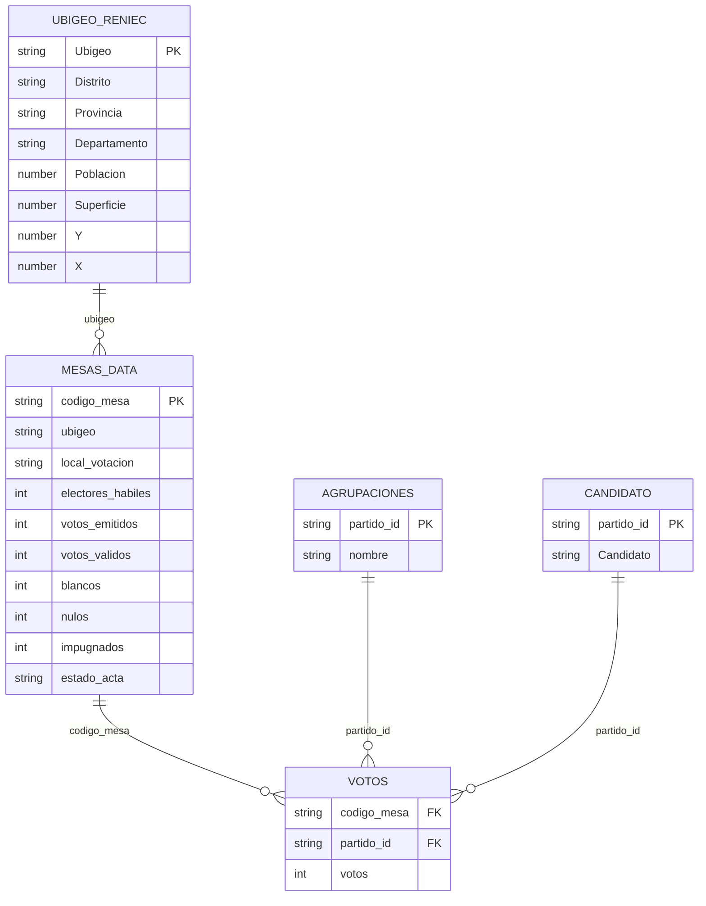

# ONPE Scraper

Scraper en Python para extraer resultados por mesa desde ONPE Peru y mantener una lista operativa de mesas pendientes.

## Estado de cobertura ONPE

La data de este repositorio esta completa al 100% respecto a lo publicado por ONPE para este corte.

- Total de mesas publicadas por ONPE: 92,766
- Mesas pendientes: 0
- Cobertura: 100%

Nota: cuando ONPE publique nuevas mesas o actualizaciones, el proceso incremental vuelve a detectar y registrar cambios.

## Objetivo

Este repositorio se enfoca solo en extraccion y publicacion de datos base.

- consulta mesas en el backend de ONPE;
- normaliza codigos de mesa;
- guarda salidas tabulares en TXT (delimitado por tab);
- actualiza `source_data/MesasFaltantes.txt` segun el estado del acta.

Nota: esta data puede usarse para analiticas (Excel, Power BI u otras herramientas), pero el modelado analitico queda fuera de este proyecto.

## ERD (Modelo de datos)



Llaves y relaciones:

- MESAS_DATA: PK codigo_mesa
- AGRUPACIONES: PK partido_id
- VOTOS: PK logica compuesta codigo_mesa + partido_id
- CANDIDATO: PK partido_id
- UBIGEO_RENIEC: PK Ubigeo
- MESAS_DATA (1) -> VOTOS (N) por codigo_mesa
- AGRUPACIONES (1) -> VOTOS (N) por partido_id
- CANDIDATO (1) -> VOTOS (N) por partido_id (mapeo manual)
- UBIGEO_RENIEC (1) -> MESAS_DATA (N) por ubigeo

## Entradas

- `source_data/MesasFaltantes.txt`: lista operativa de mesas a consultar.
- `source_data/todas_las_mesas.txt`: universo de referencia de mesas publicadas.
- `source_data/candidato.txt`: catalogo manual opcional para enriquecimiento.
- `source_data/geodir-ubigeo-reniec.xlsx`: dimension geografica por ubigeo para analisis territorial.

Origen de ubigeo:

- Fuente: Geodir (dataset RENIEC de ubigeos)
- URL de referencia: https://account.geodir.co/resources/file/recursos/geodir-ubigeo-reniec.xlsx
- En este repositorio se mantiene una copia local para cruces analiticos.

Origen de candidato (mapeo manual):

- Archivo: `source_data/candidato.txt`
- Construccion: manual
- Uso: enriquecer el modelo analitico con el nombre de candidato por `partido_id`.
- Nota: no lo genera el scraper; su mantenimiento es manual.

## Salidas

- `output/mesas_data.txt`: cabecera por mesa.
- `output/votos.txt`: detalle por mesa y agrupacion.
- `output/agrupaciones.txt`: catalogo de agrupaciones detectadas.
- `output/ubigeo_extranjero.txt`: catálogo base de exterior con columnas `ubigeo`, `Continente`, `pais`, `ciudad`.
- `output/ubigeo_extranjero_lat_lon.txt`: catálogo de exterior con `ubigeo`, `lat`, `lon` para georreferenciación fuera del Perú.

Importante:

- Los archivos de extranjero son `output/ubigeo_extranjero.txt` y `output/ubigeo_extranjero_lat_lon.txt`.
- Estos dos archivos son solo para el ámbito de extranjero.
- Su finalidad es enriquecer el análisis donde no aplica la malla de ubigeo RENIEC fuera del Perú.
- No reemplazan la dimensión RENIEC nacional; la complementan para cruces por ciudad en el exterior.

Los archivos en `output/` están listos para uso analítico directo en Excel, Power BI, SQL o notebooks, sin transformaciones complejas adicionales.

## Archivos para analítica (links directos)

### Core ONPE (Peru)

- [output/mesas_data.txt](output/mesas_data.txt)
- [output/votos.txt](output/votos.txt)
- [output/agrupaciones.txt](output/agrupaciones.txt)
- [source_data/candidato.txt](source_data/candidato.txt)
- [source_data/geodir-ubigeo-reniec.xlsx](source_data/geodir-ubigeo-reniec.xlsx)

### Extensión exterior (opcional)

- [output/ubigeo_extranjero.txt](output/ubigeo_extranjero.txt)
- [output/ubigeo_extranjero_lat_lon.txt](output/ubigeo_extranjero_lat_lon.txt)

### Operación y trazabilidad

- [source_data/todas_las_mesas.txt](source_data/todas_las_mesas.txt)
- [source_data/MesasFaltantes.txt](source_data/MesasFaltantes.txt)

## Requisitos

- Python 3.11+
- Dependencias en `requirements.txt`

## Instalacion

```bash
pip install -r requirements.txt
```

## Ejecucion

### Desde script principal

```bash
python main.py --input source_data/MesasFaltantes.txt --output-dir output --append
```

### Desde modulo

```bash
pip install -e .
python -m onpe_scraper --input source_data/MesasFaltantes.txt --output-dir output --append
```

## Scripts adicionales opcionales (exterior)

Estos scripts quedan en este repositorio porque corresponden a extracción y enriquecimiento base de geografía exterior.

### 1) Exportar ubigeo exterior (opcional)

```bash
python scripts/onpe_extranjero_export.py
```

Salida por defecto:

- `output/ubigeo_extranjero.txt`

Qué hace:

- Construye el catálogo de ciudades de votación en el extranjero.
- Estandariza a nivel `ubigeo` para posteriores cruces analíticos.

### 2) Geocodificar latitud/longitud exterior (opcional)

```bash
python scripts/extranjero_latlon.py
```

Salida por defecto:

- `output/ubigeo_extranjero_lat_lon.txt`

Qué hace:

- Cruza `ubigeo_extranjero.txt` con `mesas_data.txt` para usar `local_votacion` cuando existe.
- Aplica búsqueda geocodificada con fallback (`local, ciudad, pais` -> `pais, ciudad` -> `ciudad, pais`).
- Entrega coordenadas por `ubigeo` para expansión analítica a nivel ciudad fuera del Perú.

Estado actual:

- Ambos scripts opcionales ya fueron ejecutados en este repositorio.
- Los resultados vigentes están en `output/ubigeo_extranjero.txt` y `output/ubigeo_extranjero_lat_lon.txt`.

## Comportamiento de actualizacion

- Se trabaja en modo incremental (`--append`).
- No se sobreescribe el historico de `output/votos.txt`.
- No se duplican filas historicas ya existentes por clave (`codigo_mesa`, `partido_id`).
- `source_data/MesasFaltantes.txt` se regenera al final con mesas cuyo `estado_acta` sea distinto de `Contabilizada`.

## Supuesto tecnico vigente

El scraper consulta `/actas/buscar/mesa` y prioriza la acta de `idEleccion = 10`.
Si esa acta no esta `Contabilizada`, usa como respaldo una acta `Contabilizada` disponible para la misma mesa.
Si ONPE cambia estructura o endpoint, este supuesto debe validarse y documentarse.

## Estructura de este repositorio

```text
onpescraper/
|-- main.py
|-- pyproject.toml
|-- requirements.txt
|-- README.md
|-- output/
|   |-- agrupaciones.txt
|   |-- mesas_data.txt
|   |-- ubigeo_extranjero.txt
|   |-- ubigeo_extranjero_lat_lon.txt
|   \-- votos.txt
|-- scripts/
|   |-- onpe_extranjero_export.py
|   \-- extranjero_latlon.py
|-- source_data/
|   |-- MesasFaltantes.txt
|   |-- todas_las_mesas.txt
|   |-- candidato.txt
|   \-- geodir-ubigeo-reniec.xlsx
\-- src/
	\-- onpe_scraper/
		|-- __init__.py
		|-- __main__.py
		|-- cli.py
		\-- scraper.py
```
